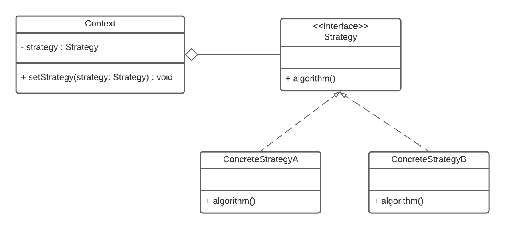
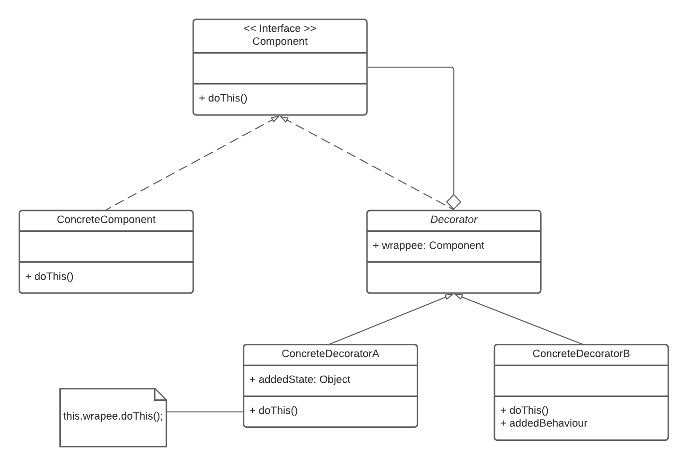
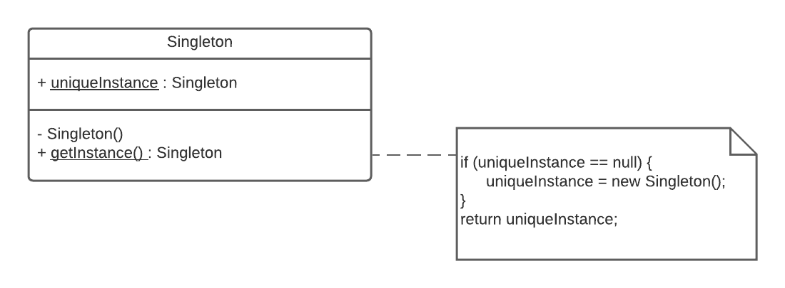
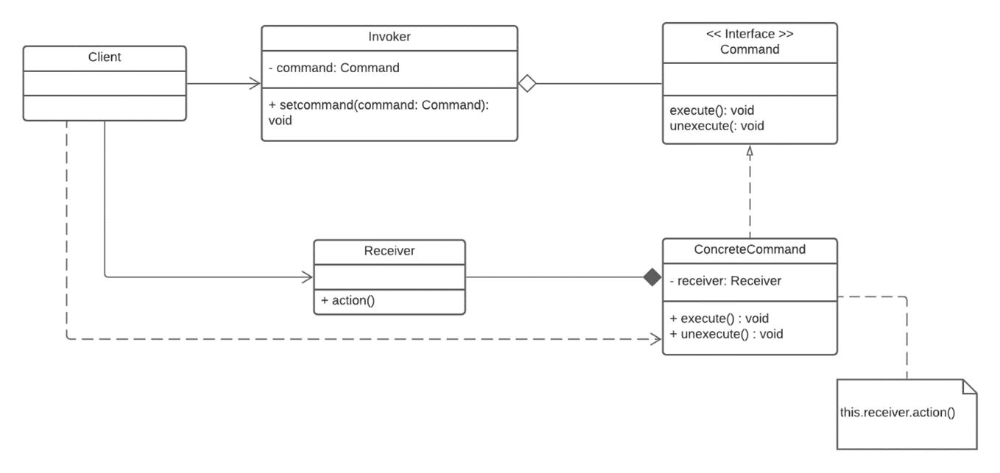

- [Strategy Pattern](#strategy-pattern)
  - [Example: Travelling](#example-travelling)
- [Observer Pattern](#observer-pattern)
  - [Example: Auctioneer and Bidders](#example-auctioneer-and-bidders)
- [Decorator Pattern](#decorator-pattern)
  - [Example: Christmas Tree](#example-christmas-tree)
- [Factory Pattern](#factory-pattern)
  - [Example: Pizza Stores](#example-pizza-stores)
- [Singleton Pattern](#singleton-pattern)
  - [Example: Chocolate Boiler](#example-chocolate-boiler)
- [Command Pattern](#command-pattern)
  - [Example: Global Remote Control](#example-global-remote-control)
- [Adapter Pattern](#adapter-pattern)
- [Facade Pattern](#facade-pattern)
- [Template Method](#template-method)
- [Iterator Pattern](#iterator-pattern)
  - [Example: Song Iterator](#example-song-iterator)

# Strategy Pattern

Defines a family of algorithms, encapsulates each one, and makes them interchangeable.  Strategy lets the algorithm vary independently from clients that use it.



## Example: Travelling

```java
public class Client {

    public static void main(String[] args) {
         // People who will travel
        Person bob = new Person("Bob", "120 Street 1");
        Person rob = new Person("Rob", "130 Street 2");
        TravelContext context = new TravelContext();

        /**
        * The Client creates a specific strategy object and passes it to the context.
        * The context exposes a setter which lets clients replace the strategy associated with the context at runtime.
        **/
        CarStrategy car = new CarStrategy();
        context.setStrategy(car);

        context.takeTrip(bob, "airport");
        context.takeTrip(rob, "fairmont hotel");
    }
}

public class TravelContext {

    private TravelStrategy strategy;

    public void setStrategy(TravelStrategy strategy){
        this.strategy = strategy;
    }

    /** The context calls the algorithm on the linked strategy object each time it needs to run the algorithm.

    * The context does not know what type of strategy it uses or how the algorithm is executed.
    **/
public void takeTrip(Person person, String location){
        this.strategy.travel(person, location);
    }
}

// The interface encapsulates the behavior of the algorithms
public interface TravelStrategy {

    public void travel(Person person, String location);

}

// Concrete implementations of the strategy
public class CarStrategy implements TravelStrategy{

    @Override
    public void travel(Person person, String location) {
        person.setLocation(location);
        System.out.printf(person.getName() + " has travelled by car to " + person.getLocation() + "\n");
    }
}

public class BusStrategy implements TravelStrategy{

    @Override
    public void travel(Person person, String location) {
        person.setLocation(location);
        System.out.println(person.getName() + " has travelled by bus to " + person.getLocation() + "\n");
    }
}
```

# Observer Pattern
Defines a one-to-many dependency between objects so that when one object changes state, all its dependents are notified and updated automatically.


**Pull Communication Method**: The Observable just sends a short message to observers to notify them that something has changed, the observers are responsible for pulling the data they need from the Observer.

**Push Communication Method**: The Observable just sends all information to the observers; the observers decide what to use.

## Example: Auctioneer and Bidders

```java
import java.util.ArrayList;
import java.util.Observable;
import java.util.Observer;


/**
 * A class for an auctioneer at an auction.  An auctioneer receives bids, 
 * keeps track of the highest bid and notifies all bidders a new higher bid 
 * has been placed.
*/
public class Auctioneer extends Observable {

    ArrayList<Bid> bids; //list of bids received
    int highestBid;

    public Auctioneer(){
        this.bids = new ArrayList<Bid>();
        this.highestBid = 0;
    }


    /**
     * Receives a passed bid.  If the bid is higher than the current highest bid,
     * the highest bid is updated and auctioneers are notified.
    */
    public void receiveBid(Bid bid){
        this.bids.add(bid);
        if (bid.amount > this.highestBid){
            this.highestBid = bid.amount;
            this.setChanged();
            this.notifyObservers("The highest bid is now " + bid.amount + " with ID: " + bid.id);
        }
    }
}

/**
 * A class for a bidder in an auction. A bidder passes bids.
*/
public class Bidder implements Observer {

    public Bid makeBid(int amount, String id){
        Bid bid = new Bid(amount, id);
        return bid;}

    @Override
    public void update(Observable o, Object arg) {
        System.out.println(arg);
    }
}

/**
 * A class for an auction.  An auction has an auctioneer and a list of bidders.
*/
public class Auction {

    Auctioneer auctioneer;
    ArrayList<Bidder> bidders;

    public Auction(){
        this.auctioneer = new Auctioneer();
        this.bidders = new ArrayList<Bidder>();
    }

    public void addBidder(Bidder bidder){
        this.bidders.add(bidder);
        this.auctioneer.addObserver(bidder); // new bidders observe the auctioneer
    }

    public static void main(String[] args){

        // Create an auction with 3 bidders
        Auction auction = new Auction();
        Bidder bidder1 = new Bidder();
        Bidder bidder2 = new Bidder();
        Bidder bidder3 = new Bidder();

        auction.addBidder(bidder1);
        auction.addBidder(bidder2);
        auction.addBidder(bidder3);

        Auctioneer auctioneer = auction.auctioneer;
        auctioneer.receiveBid(bidder1.makeBid(20, "Bid01"));
        auctioneer.receiveBid(bidder2.makeBid(50, "Bid02"));
    }
}

/** 
* A class for a Bid in an auction.  A bid has an amount and an ID.
*/
public class Bid {

    int amount;
    String id;

    public Bid(int amount, String id){
        this.amount = amount;
        this.id = id;
    }
}
```

# Decorator Pattern

Attaches additional responsibilities to an object dynamically.  The decorator pattern involves a set of decorating classes that are used to wrap concrete components.  Decorators provide a flexible alternative to subclassing for extending functionality.  



## Example: Christmas Tree

```java
public interface ChristmasTree {

    public String decorate();
}

// Concrete component
public class PineChristmasTree implements ChristmasTree{

    @Override
    public String decorate(){
        return "Pine christmas tree";
    }
}

// Decorator abstract class
public abstract class Decorator implements ChristmasTree{

    public ChristmasTree wrappee;
    
    public Decorator(ChristmasTree wrappee){
        this.wrappee = wrappee;
    }
}

// Concrete decorators
public class TreeLights extends Decorator{

    public TreeLights(ChristmasTree wrappee) {
        super(wrappee);
    }

    @Override
    public String decorate() {
        return this.wrappee.decorate() + " with lights";
    }
}

public class TreeTopper extends Decorator{

    public TreeTopper(ChristmasTree wrappee){
        super(wrappee);
    }

    @Override
    public String decorate(){
        return this.wrappee.decorate() + " with tree topper";
    }
}

// Client wraps concrete components with decorator classes
public class TreeClient {

    public static void main(String[] args) {
        ChristmasTree myTree = new TreeTopper(new TreeLights(new PineChristmasTree()));

        System.out.println("Let's decorate my tree: " + myTree.decorate());
    }
}
```

# Factory Pattern

Defines an abstract class for creating an object, but allows subclasses to decide what objects to instantiate.  It lets a class defer instantiation to subclasses.


The Creator class gives you an interface with a method for creating objects, also known as the factory method.

Any other methods implemented in the abstract Creator class are written to operate on products produced but the factory method – the creator class is written without knowledge of the actual products that will be created.

## Example: Pizza Stores

```java
// Abstract 'Creator' class
public abstract class PizzaStore {

    public Pizza orderPizza(String type){
        Pizza pizza = this.factoryMethod(type);

        pizza.prepare();
        pizza.bake();
        pizza.box();

        return pizza;
    }

    public abstract Pizza factoryMethod(String type);
}

// Concrete creators decide which product class to instantiate
public class NYPizzaStore extends PizzaStore{

    @Override
    public Pizza factoryMethod(String type) {
        return switch (type) {
            case "pepperoni" -> new NYPepperoniPizza();
            default -> new NYCheesePizza();
        };
    }
}

public class ChicagoPizzaStore extends PizzaStore{

    @Override
    public Pizza factoryMethod(String type) {
        return switch (type) {
            case "pepperoni" -> new ChicagoPepperoniPizza();
            default -> new ChicagoCheesePizza();
        };
    }
}

// Abstract 'Product' class
public class Pizza {

    String crust;
    String type;
    ArrayList<String> ingredients;

    public Pizza(String crust, String type, ArrayList<String> ingredients){
        this.crust = crust;
        this.type = type;
        this.ingredients = ingredients;
    }

    public void prepare(){
        String info = "Preparing a " + this.type + " pizza with " +
                this.crust + " crust";

        for(String ingredient : this.ingredients){
            info += " and " + ingredient;
        }

        System.out.println(info);
    }

    public void bake(){
        System.out.println("Baking pizza...");
    }

    public void box(){ System.out.println("Boxing pizza..."); }

}

// Concrete product classes
public class NYPepperoniPizza extends Pizza {

    public NYPepperoniPizza(){
        super("thin", "pepperoni", new ArrayList<String>());
        this.ingredients.add("cheese");
        this.ingredients.add("pepperoni");
        this.ingredients.add("oregano");
    }
}

public class ChicagoPepperoniPizza extends Pizza{

    public ChicagoPepperoniPizza(){
        super("thick", "pepperoni", new ArrayList<String>());
        this.ingredients.add("cheese");
        this.ingredients.add("pepperoni");
        this.ingredients.add("oil");
    }
} 
```

Notice how encapsulated the creation of the pizzas is from the client:

```java
public class Client {

    public static void main(String[] args) {
        PizzaStore nyc = new NYPizzaStore();
        PizzaStore chi = new ChicagoPizzaStore();

        // Harvey's order
        nyc.orderPizza("pepperoni");

        //Jessica's order
        chi.orderPizza("pepperoni");
    }
}
```

```
Preparing a pepperoni pizza with thin crust and cheese and pepperoni and oregano
Baking pizza...
Boxing pizza...

Preparing a pepperoni pizza with thick crust and cheese and pepperoni and oil
Baking pizza...
Boxing pizza...
```

# Singleton Pattern

Ensures a class has only one instance of an object and provides a global point of access. We are letting the class manage a single instance of itself.



## Example: Chocolate Boiler

```java
/** Assume we have a factory with a single chocolate boiler. 

* We're going to write a program that controls it so that bad things don't happen.
* (e.g. the program creates two boiler instances and fills up an full boiler -> overflow!)
**/

public class ChocolateBoiler {
    
    private boolean isEmpty;
    private boolean isBoiled;
    private static uniqueInstance;

    /**
    * Private constructor so only the class can call create
    * an instance of itself.
    **/
    private ChocolateBoiler(){
        this.isEmpty = false;
        this.isBoiled = false;
    }

    /**
    * This method is the global point of access.  Whether the instance
    * exists or not, this is the only way another class can access it.
    **/
    public static ChocolateBoiler getInstance(){
        if(uniqueInstance == null){
            uniqueInstance = new ChocolateBoiler();
        }
        return uniqueInstance;
    }

    // Other useful methods...
}
```

# Command Pattern

Encapsulates a request as an object, thereby letting you parametrize other objects with different requests,  queue or log requests and support undoable operations.  It decouples the requester of an action from the object that actually performs the action.

In this way the same object can be parametrized in multiple ways with all sort of commands as long as they implement the Command interface!



A command object encapsulates a request by binding together a set of actions on a specific receiver.  To achieve this it packages the actions and the receiver into an object that only exposes the method `execute()`.

> The Null Object
> 
>A **null object** is useful when you don’t have a meaningful object to return, and yet you want to remove the responsibility for handling a `null` from the client.  It is common to use a `NoCommand` null object for unassigned invokers. (See the Remote Control constructor below).

In general, we strive for “dumb” command objects that just invoke an action on the receiver so we can maintain the same level of decoupling between the invoker and the receiver.

## Example: Global Remote Control

```java 
// INVOKER
public class RemoteControl {

    public Command[] onCommands;

    public RemoteControl(){
        this.onCommands = new Command[4];

        Command noCommand = new NoCommand();
        for(int i = 0; i < 4; i++){
            onCommands[i] = noCommand;
        }
    }

    public void setCommand(int slot, Command onCommand){
        if (slot < 4 && slot >= 0){
            this.onCommands[slot] = onCommand;
        }
    }

    
    public void buttonPushed(int slot){
        if (slot < 4 && slot >= 0){
            this.onCommands[slot].execute();
        }
    }
}

// RECEIVERS  + COMMANDS
public interface Command { 
    public void execute();
}

// Receiver I
public class Alarm {

    public void arm(){
        System.out.println("Alarm is armed. Please exit the building in the next minute.");
    }

    public void disarm(){
        System.out.println("Alarm is disarmed.");
    }
}
// Command I
public class AlarmArmCommand implements Command{

    private Alarm alarm;

    public AlarmArmCommand(Alarm alarm){
        this.alarm = alarm;}

    @Override
    public void execute() {this.alarm.arm();}
}

// Receiver II
public class GarageDoor {

    public void up(){
        System.out.println("Garage door is up.");}

    public void down(){
        System.out.println("Garage door is down.");
    }
}
// Command II
public class GarageOpenCommand implements Command {

    private GarageDoor door;

    public GarageOpenCommand(GarageDoor door){
        this.door = door;}

    @Override
    public void execute() {this.door.up();
    }

// Receiver III
public class Light {

    String location;

    public Light(String location){
        this.location = location;}
    public void on(){
        System.out.println("The light in the " + this.location + " is on.");
    }

    public void off(){
        System.out.println("The light in the " + this.location + " is on.");
    }
}
// Command III
public class LightOnCommand implements Command{

    private Light light;

    public LightOnCommand(Light light){
        this.light = light;
    }

    @Override
    public void execute() {this.light.on();}
}

// NOCOMMAND + MACROCOMMAND
public class NoCommand implements Command{

    @Override
    public void execute() { }
}

public class MacroCommand implements Command{

    Command[] commands;

    public MacroCommand(Command[] commands){
        this.commands = commands;
    }

    @Override
    public void execute() {
        for(int i = 0; i < this.commands.length; i++){
            this.commands[i].execute();
        }
    }
```

Now notice how the client sets the entire mechanism in motion:

```java
// CLIENT
public class Client {

    public static void main(String[] args) {

        // create the receivers of the remote
        GarageDoor garageDoor = new GarageDoor();
        Alarm alarm = new Alarm();
        Light porchLight = new Light("front porch");

        // create corresponding commands and bind them up to the receivers
        GarageOpenCommand garageDoorUp = new GarageOpenCommand(garageDoor);
        AlarmArmCommand alarmArm = new AlarmArmCommand(alarm);
        LightOnCommand porchLightOn = new LightOnCommand(porchLight);
        MacroCommand comeHomeCommand = new MacroCommand(new Command[]{garageDoorUp, porchLightOn});

        
        // load commands into the invoker
        RemoteControl remote = new RemoteControl();
        remote.setCommand(0, garageDoorUp);
        remote.setCommand(1, alarmArm);
        remote.setCommand(2, porchLightOn);
        remote.setCommand(3, comeHomeCommand);

        // use remote!
        remote.buttonPushed(0);
        remote.buttonPushed(1);
        remote.buttonPushed(2);

        remote.buttonPushed(3);
    }
}
```

```
Garage door is up.
Alarm is armed. Please exit the building in the next minute.
The light in the front porch is on.

Garage door is up.
The light in the front porch is on.
```

# Adapter Pattern

# Facade Pattern

# Template Method

# Iterator Pattern

Provides a way to access the elements of an aggregate object sequentially without exposing its underlying representation.


## Example: Song Iterator

```java
// Array implementation of song list
public class YourSongs implements Iterable<Song> {

Song[] songs;
	
	public YourSongs() {
		songs = new Song[3];
		
		songs[0] = new Song("Britney Spears", "Hit Me Baby One More Time");
		songs[1] = new Song("Aqua", "Barbie Girl");
		songs[2] = new Song("Spice Girls", "Wannabe");

	}

	public Iterator<Song> iterator(){
        return new SongsIterator(this.songs);
    }
}

// Array song list iterator
public class YourSongsIterator implements Iterator<Song> {

	private Song[] songs;
	private int indexKey;
	
	public YourSongsIterator(Song[] s) {
		this.songs = s;
		this.indexKey = 0;
	}

	@Override
	public boolean hasNext(){
        return (this.indexKey + 1) < this.songs.length;
    }

	@Override
	public Song next(){
        if (this.hasNext()){ 
            return this.songs[this.indexKey++]; 
        }
		return null;
    }
}

// HashMap implementation of song list
public class MySongs implements Iterable<Song> {

	 HashMap<Integer, Song> mySongs;
	 
	 public MySongs() {
		 mySongs = new HashMap<Integer, Song>();
		 
		 mySongs.put(0, new Song("Green Day", "American Idiot"));
		 mySongs.put(1, new Song("AC/DC", "Highway to Hell"));
		 mySongs.put(2, new Song("Bon Jovi", "Livin' On a Prayer"));
	 }

	@Override
	public Iterator<Song> iterator() {
		return new MySongsIterator(mySongs);
	}
}

// HashMap song list iterator
public class MySongsIterator implements Iterator<Song> {

	private HashMap<Integer, Song> songs;
	private int indexKey;
	
	public MySongsIterator(HashMap<Integer, Song> s) {
		this.songs = s;
		indexKey = 0;
	}
	
	@Override
	public boolean hasNext() {
		return this.indexKey < this.songs.size();
	}

	@Override
	public Song next() {
		return this.songs.get(indexKey++);
	}

}
```
